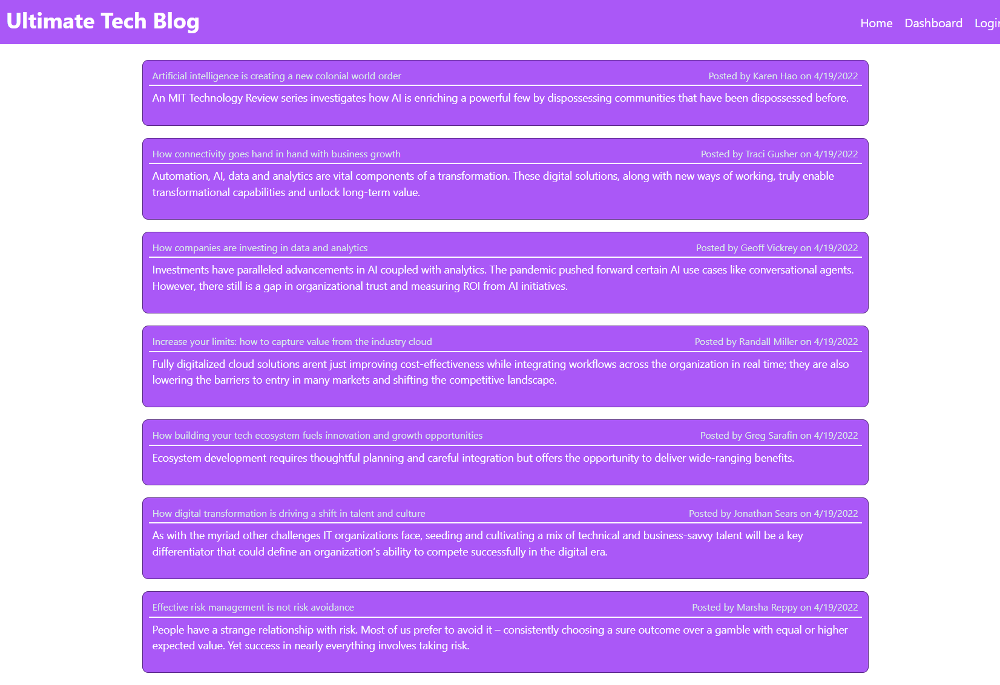
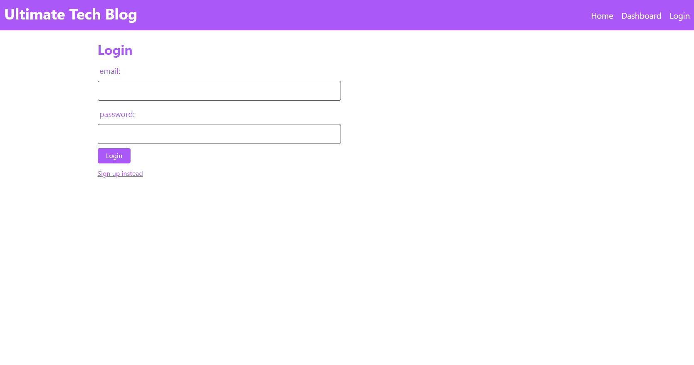

# Ultimate Tech Blog

## Description
Ultimate Tech Blog is a platform for tech-related topics. Users can read the posts but must have an account in order to make a post or add a comment. Account owners are also able to update or delete their posts. Ultimate Tech Blog was created for people in the technology industry to have more interactions and exchanges. 

## Table of Contents

- [Installation](#installation)

- [Usage](#usage)

- [Technologies Used](#technologies)

- [Tests](#tests)

- [License](#license)

- [Questions](#questions)

## Installation 
User will need to head to the website in order to use its functions.

## Usage 

## Technologies
This application was created with html, css, javascript, and mySql. Other tools used were express handlebars, sequelize, dotenv, bcrypt, express-session, and express-session-sequelize. This application is deployed with Heroku, with JAWSDB MYSQL as a resource.

## Tests
none

## License
This application does not have a license.

## Questions

Github Link: https://github.com/ycheng2021/Ultimate-Tech-Blog

Deployed Link: https://ancient-peak-76701.herokuapp.com/

If you have any additional questions, feel free to reach me at annacheng09@hotmail.com
